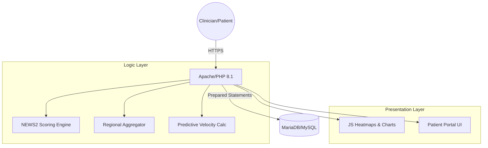
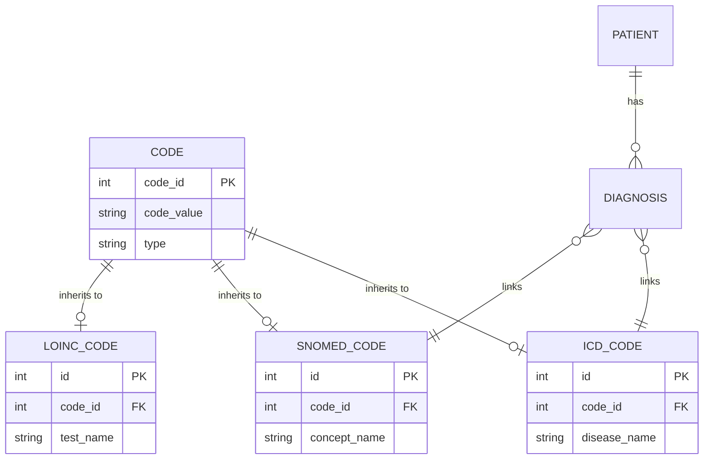

# MedPulse Visual Documentation

## 1. System Architecture (3-Tier)

```mermaid
graph TD
    User((Clinician/Patient)) -->|HTTPS| WebServer[Apache/PHP 8.1]
    WebServer -->|Prepared Statements| Database[(MariaDB/MySQL)]
    
    subgraph "Logic Layer"
        WebServer --> NEWS2[NEWS2 Scoring Engine]
        WebServer --> Agg[Regional Aggregator]
        WebServer --> Velocity[Predictive Velocity Calc]
    end
    
    subgraph "Presentation Layer"
        WebServer --> Dashboard[JS Heatmaps & Charts]
        WebServer --> Portal[Patient Portal UI]
    end
```

## 2. Database Inheritance Pattern (Master Code)

```mermaid
erDiagram
    CODE {
        int code_id PK
        string code_value
        string type
    }
    ICD_CODE {
        int id PK
        int code_id FK
        string disease_name
    }
    SNOMED_CODE {
        int id PK
        int code_id FK
        string concept_name
    }
    LOINC_CODE {
        int id PK
        int code_id FK
        string test_name
    }
    
    CODE ||--o| ICD_CODE : "inherits to"
    CODE ||--o| SNOMED_CODE : "inherits to"
    CODE ||--o| LOINC_CODE : "inherits to"
    
    PATIENT ||--o{ DIAGNOSIS : "has"
    DIAGNOSIS }o--|| ICD_CODE : "links"
    DIAGNOSIS }o--|| SNOMED_CODE : "links"
```

## 3. Region Hierarchy (Self-Referencing)

```mermaid
graph LR
    Division[Division] -->|Parent| District[District]
    District -->|Parent| SubDistrict[Sub-district]
    SubDistrict -->|Links| Patient[Patient Population]
```
